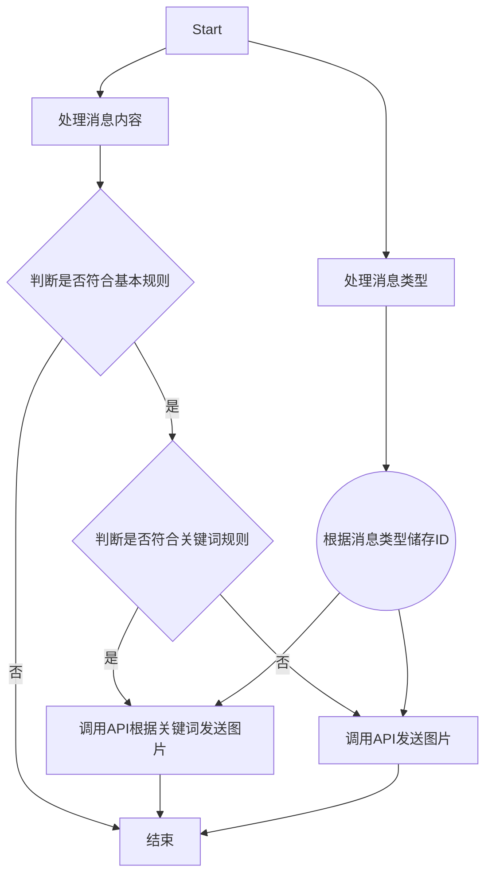

### 消息处理流程

```mermaid
graph TD
 start[Start] --> a[处理消息类型]
a --> b((根据消息类型储存ID))
start-->c[处理消息内容]
c-->d{判断是否符合基本规则}
d--是-->e{判断是否符合关键词规则}
d--否-->z[结束]
e--是-->f[调用API根据关键词发送图片]
e--否-->g[调用API发送图片]
 f-->z
 g-->z
b-->f
b-->g
```